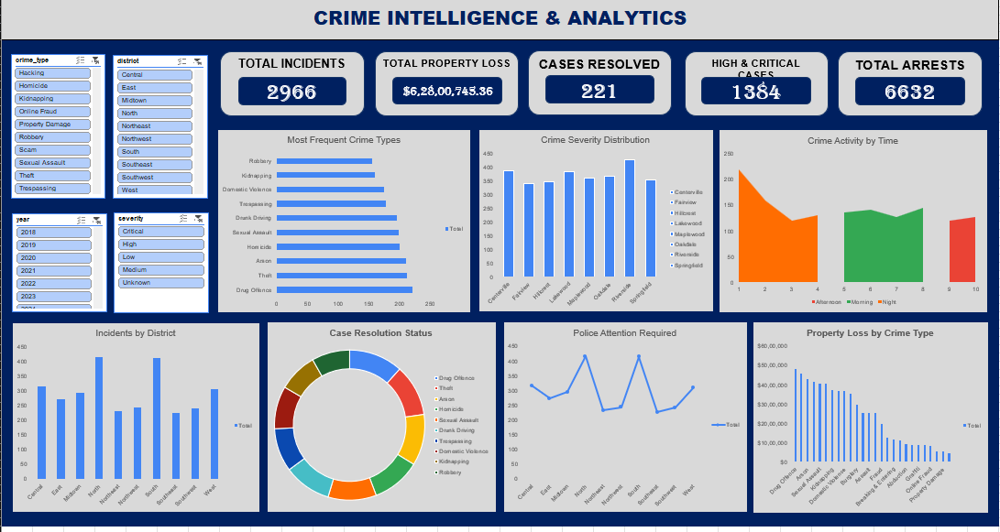

# Crime Intelligence & Analytics

An Excel-based **Crime Intelligence & Analytics Dashboard** designed to analyze crime incidents, severity, case resolution, police attention, crime timing, arrests, and property losses.

The project demonstrates a complete data-analysis workflow:

**Raw Data → Data Cleaning → Data Transformation → Pivot Analysis → Dashboard → Business Insights**



---

## Project Overview

This project analyzes a messy crime-incident dataset and transforms it into a structured dataset suitable for analysis and visualization.

The dashboard provides an interactive view of:

- Total crime incidents
- Total property loss
- Cases resolved
- High & critical severity cases
- Total arrests
- Most frequent crime types
- Crime distribution by district
- Crime severity distribution
- Crime activity by time period
- Case resolution status
- Police attention required
- Property loss by crime type

---

## Dataset Information

The original dataset contains **5,250 crime records** and **33 columns**.

After cleaning and removing invalid/duplicate records, the final dataset contains **2,966 records** and **40 columns**.

| Dataset | Rows | Columns |
|---|---:|---:|
| Raw Data | 5,250 | 33 |
| Clean Data | 2,966 | 40 |

The additional columns in the cleaned dataset are derived analytical fields used for dashboard analysis.

---

## Data Structure

### Original Columns

The raw dataset contains information related to:

### Incident Information
- `incident_id`
- `crime_type`
- `district`
- `city`
- `state`
- `address`
- `latitude`
- `longitude`
- `incident_datetime`

### Officer Information
- `officer_id`
- `officer_first_name`
- `officer_last_name`
- `badge_number`

### Suspect Information
- `suspect_id`
- `suspect_first_name`
- `suspect_last_name`
- `suspect_age`
- `suspect_gender`
- `suspect_race`

### Victim Information
- `victim_id`
- `victim_first_name`
- `victim_last_name`
- `victim_age`
- `victim_gender`
- `victim_phone`

### Crime & Case Information
- `weapon_used`
- `severity`
- `case_status`
- `resolution`
- `num_arrests`
- `property_loss_usd`
- `reported_online`
- `notes`

---

## Additional Columns Created During Cleaning

The cleaned dataset contains 7 additional analytical columns:

| Column | Purpose |
|---|---|
| `year` | Extracted year from incident date |
| `month` | Extracted month |
| `month_number` | Numerical month used for chronological analysis |
| `day_name` | Day of the week |
| `hour` | Hour extracted from incident time |
| `time_period` | Categorizes incidents into Morning, Afternoon, Evening, or Night |
| `resolved_flag` | Indicates whether the case was resolved |

This increased the dataset from **33 to 40 columns**.

---

## Data Cleaning Process

The raw dataset contained several quality issues, including duplicate records, inconsistent naming, invalid values, inconsistent capitalization, abbreviations, and inconsistent categorical values.

### 1. Duplicate Removal

The raw dataset contained **200 duplicate records**.

These duplicate records were removed during cleaning.

- Raw records: **5,250**
- Duplicate records removed: **200**
- Final records: **2,966**

The cleaned dataset contains no duplicate incident IDs.

---

### 2. Crime Type Standardization

Crime names were inconsistent in the raw dataset.

Examples included:

```text
asslt
Assault
Homocide
Homicide
Domestc Violence
robbery
Robbery
```

These were standardized into consistent categories such as:

```text
Assault
Homicide
Domestic Violence
Robbery
```

The cleaned dataset contains **26 standardized crime types**.

---

### 3. District Standardization

District names contained abbreviations and inconsistent capitalization.

Examples:

```text
Sou
South
southeast
SouthEast
Cen
Central
midtown
Midtown
```

These were standardized into consistent district names.

The final dataset contains **10 districts**.

---

### 4. Gender Standardization

Multiple representations of the same gender were present.

For example:

```text
M
m
MALE
male
Male

F
f
FEMALE
female
Female
```

These values were standardized into:

```text
Male
Female
Other
Unknown
```

---

### 5. Severity Standardization

Severity values were represented using both text and numeric codes.

Examples:

```text
1
2
3
Low
MEDIUM
high
Crit
High
```

These were converted into consistent severity categories:

```text
Low
Medium
High
Critical
Unknown
```

---

### 6. Case Status Standardization

Case status values also contained inconsistent capitalization and spelling.

Examples:

```text
Open
open
CLOSED
Closed
under investigation
Investgation
Resolved
```

These were standardized into consistent categories such as:

```text
Open
Closed
Resolved
Under Investigation
Pending
Unknown
```

---

### 7. Resolution Standardization

Different variations of resolutions were consolidated.

Examples:

```text
No Arrest
NO ARREST
arrest made
Arres Made
warning
Warning Issued
Dismissed
```

These were standardized into:

```text
No Arrest
Arrest Made
Warning Issued
Case Dismissed
Unknown
```

---

### 8. Weapon Type Standardization

Weapon descriptions were inconsistent in capitalization and naming.

Examples:

```text
KNIFE
Knife
hands
Hands/Feet
Firearm
Unarmed
```

These were standardized into consistent categories such as:

```text
Firearm
Knife
Blunt Object
Hands/Feet
Unarmed
Unknown
```

---

### 9. Age Validation

Suspect and victim ages contained invalid values.

Examples from the raw data included:

```text
-28
231
243
262
```

Invalid or unusable age values were handled during cleaning and represented appropriately as `Unknown` where required.

---

### 10. Missing Value Handling

Missing and unusable values were identified across the dataset.

Depending on the field, missing values were:

- Replaced with `Unknown`
- Replaced with `N/A`
- Retained where absence itself was meaningful
- Excluded when the record could not reliably be used for analysis

The cleaned dataset therefore contains substantially fewer missing values than the raw dataset.

---

### 11. Date & Time Transformation

The `incident_datetime` column was transformed into separate analytical fields.

For example:

```text
incident_datetime
        ↓
year
month
month_number
day_name
hour
time_period
```

`time_period` groups incidents into:

```text
Morning
Afternoon
Evening
Night
```

This enables analysis of crime activity throughout the day.

---

### 12. Case Resolution Flag

A derived `resolved_flag` column was created to simplify case-resolution analysis.

Example:

```text
Resolved / Closed case → Yes
Unresolved / Open case → No
```

This field is used to calculate case-resolution metrics and support the dashboard's resolution analysis.

---

## Workbook Structure

The Excel workbook is organized into the following sheets:

### `RAW DATA`

Contains the original, uncleaned crime dataset.

**5,250 records × 33 columns**

This sheet is preserved as the source dataset for comparison and data-cleaning purposes.

### `CLEAN DATA`

Contains the processed dataset after cleaning, standardization, validation, and feature creation.

**2,966 records × 40 columns**

This is the primary dataset used for analysis.

### `PIVOT TABLE`

Contains the pivot-table calculations used to generate dashboard visualizations and answer analytical questions.

Examples include:

- Most frequent crime type
- Crime count by district
- Crime activity by time
- Property loss by crime type
- Crime severity
- Case resolution
- Police attention

### `Dashboard`

Contains the final interactive Excel dashboard.

### `Summary Points — Key Business Insights`

Contains the section intended for documenting important findings and observations from the analysis.

---

## Dashboard Components

The dashboard contains the following major components.

### KPI Cards

- **Total Incidents**
- **Total Property Loss**
- **Cases Resolved**
- **High & Critical Cases**
- **Total Arrests**

### Visualizations

**Most Frequent Crime Types**

Shows which crime categories occur most frequently.

**Crime Severity Distribution**

Shows the distribution of incidents across severity levels.

**Crime Activity by Time**

Analyzes crime activity across:

- Morning
- Afternoon
- Evening
- Night

**Incidents by District**

Compares crime volume across different districts.

**Case Resolution Status**

Shows the distribution of case resolutions.

**Police Attention Required**

Highlights districts requiring greater police attention based on incident volume.

**Property Loss by Crime Type**

Identifies crime categories associated with higher financial losses.

---

## Interactive Filters

The dashboard includes filters/slicers for:

- Crime Type
- District
- Year
- Severity

These filters allow users to dynamically explore specific sections of the dataset.

---

## Tools Used

- **Microsoft Excel**
- Excel Tables
- Data Cleaning
- Data Transformation
- Pivot Tables
- Pivot Charts
- Slicers
- Dashboard Design
- Data Analysis

---

## Analytical Workflow

```text
Raw Crime Dataset
        ↓
Data Quality Inspection
        ↓
Duplicate Removal
        ↓
Data Cleaning
        ↓
Category Standardization
        ↓
Missing / Invalid Value Handling
        ↓
Date & Time Transformation
        ↓
Derived Analytical Columns
        ↓
Clean Dataset
        ↓
Pivot Tables
        ↓
Charts & KPIs
        ↓
Interactive Dashboard
        ↓
Business Insights
```

---

## Project Objective

The objective of this project is to demonstrate how a messy real-world-style dataset can be converted into a structured analytical dataset and presented through an interactive dashboard.

The analysis focuses on answering questions such as:

- Which crimes occur most frequently?
- Which districts experience the most incidents?
- When does crime activity peak?
- Which crime types generate the highest property loss?
- Which crimes have higher severity?
- How many cases are resolved?
- Which districts require greater police attention?
- How many arrests are associated with reported incidents?

---

## Key Skills Demonstrated

- Data Cleaning
- Data Validation
- Data Transformation
- Exploratory Data Analysis
- Excel Pivot Tables
- Data Visualization
- Dashboard Development
- KPI Development
- Business-Oriented Analysis
- Interactive Reporting

---

## Project Files

```text
Crime-Intelligence-Analytics/
│
├── README.md
├── Crime_analysis.xlsx
└── dashboard.png
```

---

## Dashboard Preview

The dashboard provides a single-page view of crime patterns, severity, resolution, arrests, police attention, and financial impact, allowing users to interactively explore the cleaned dataset.

---

## Conclusion

This project demonstrates an end-to-end Excel data analytics workflow, starting with a messy crime dataset and transforming it into a clean, structured dataset and interactive dashboard.

The project combines **data cleaning, transformation, analytical modeling, visualization, and business insights** to make crime-related information easier to understand and analyze.